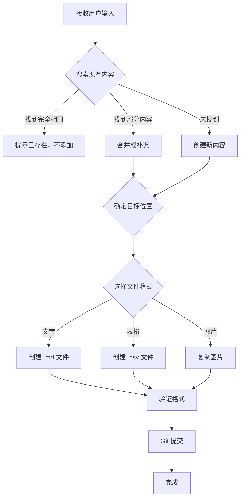

# AI 添加内容指南

> 本指南帮助 AI 助手正确地往知识库中添加新内容，避免重复，保持结构清晰。

---

## ⚡ 快速开始

**时间紧张？先看这个：** [AI快速参考.md](./AI快速参考.md) - 5 秒钟速查卡片

**完整指南：** 继续往下读 👇

---

## 🎯 核心原则

### 1️⃣ **先搜索，后添加**

在添加任何内容前，**必须**先搜索现有知识库，确认：
- ✅ 是否已有相同或相似内容
- ✅ 应该添加到哪个目录
- ✅ 是否需要合并还是新建

### 2️⃣ **遵循目录结构**

严格按照地理位置/区域组织内容：
```
重庆-吃/
├── 三峡广场沙坪坝站龙湖重庆金沙天街/
├── 南山/
├── 杨家坪/
├── 牛角沱/
├── 石桥铺/
├── 磁器口、双碑/
└── 重庆-cqu-吃-食堂、学校附近/
    ├── 火锅/
    ├── 熙街/
    └── ... (其他子目录)
```

### 3️⃣ **格式统一**

- 文字记录 → `.md` 文件（带 YAML frontmatter）
- 表格数据 → `.csv` 文件（utf-8-sig 编码）
- 图片 → 原样复制到对应目录

---

## 🔍 第一步：搜索现有内容

### 搜索命令示例

```bash
# 1. 搜索特定餐厅名称
grep -r "餐厅名" 重庆-吃/

# 2. 搜索特定区域
ls 重庆-吃/ | grep "区域名"

# 3. 搜索特定菜品类型
grep -r "火锅" 重庆-吃/

# 4. 查看所有 Markdown 文件
find 重庆-吃/ -name "*.md"

# 5. 查看所有 CSV 文件
find 重庆-吃/ -name "*.csv"
```

### PowerShell 等价命令

```powershell
# 搜索关键词
Get-ChildItem -Recurse 重庆-吃\ -Include *.md,*.csv | Select-String "关键词"

# 列出目录
Get-ChildItem 重庆-吃\ -Directory

# 查找文件
Get-ChildItem -Recurse 重庆-吃\ -Filter "*.md"
```

### 判断标准

| 情况 | 操作 |
|------|------|
| 找到完全相同的餐厅 | ❌ 不添加，提示已存在 |
| 找到同一区域的其他餐厅 | ✅ 合并到现有文件或新建同级文件 |
| 找到相似但不完全相同 | ✅ 补充新信息到现有文件 |
| 完全没找到 | ✅ 创建新文件 |

---

## 📂 第二步：确定目标位置

### 目录选择规则

#### 规则 1：按地理位置归类

```
餐厅在三峡广场附近 → 三峡广场沙坪坝站龙湖重庆金沙天街/
餐厅在南山         → 南山/
餐厅在杨家坪       → 杨家坪/
餐厅在牛角沱       → 牛角沱/
餐厅在石桥铺       → 石桥铺/
餐厅在磁器口/双碑  → 磁器口、双碑/
餐厅在重大附近     → 重庆-cqu-吃-食堂、学校附近/
```

#### 规则 2：特殊类型单独建子目录

在 `重庆-cqu-吃-食堂、学校附近/` 下：
```
火锅店   → 火锅/
熙街美食 → 熙街/
日料     → 26-01-25-大学城日料/
面馆     → 万州面馆/
炒菜     → 大学城炒菜/
烧烤     → 小目标东北烧烤/
...
```

#### 规则 3：不确定时放在根目录

如果无法确定具体位置，先放在对应大区域的根目录，后续再整理。

---

## 📝 第三步：准备文件格式

### A. 添加文字记录（.md）

#### 格式模板

```markdown
---
source_file: "手动添加_餐厅名.md"
converted_date: "YYYY-MM-DD"
added_by: "AI Assistant"
---

# 餐厅名称

## 基本信息

- **类型**: 火锅/江湖菜/面馆等
- **位置**: 详细地址或地标
- **人均**: XX 元
- **评分**: X.X/5.0

## 推荐菜品

1. 菜品1 - 描述
2. 菜品2 - 描述
3. 菜品3 - 描述

## 优点

- 优点1
- 优点2

## 缺点

- 缺点1
- 缺点2

## 用户评价

> 引用具体的用户评论或体验

## 图片


## 备注

其他补充信息...
```

#### 示例

```markdown
---
source_file: "手动添加_妈也食堂.md"
converted_date: "2026-06-12"
added_by: "AI Assistant"
---

# 妈也食堂

## 基本信息

- **类型**: 江湖菜 / 川菜
- **位置**: 上新街
- **人均**: 50 元
- **评分**: 4.8/5.0

## 推荐菜品

1. 过江兔 - 麻辣鲜香，肉质嫩滑
2. 泡椒双脆 - 口感爽脆，味道浓郁
3. 凉拌黄瓜 - 清爽解腻

## 优点

- 重庆正宗麻辣口味
- 食材新鲜
- 分量巨大
- 可提前电话下单
- 2 人套餐划算
- 装修有特色

## 缺点

- 部分菜品偏辣
- 高峰时段可能排队

## 用户评价

> "味道巴适，性价比高，强烈推荐！" - 本地食客

## 备注

适合朋友聚餐，重口味爱好者首选。
```

---

### B. 添加表格数据（.csv）

#### 格式要求

1. **编码**: `utf-8-sig`（带 BOM，Excel 打开不乱码）
2. **表头**: 第一行必须是列名
3. **字段建议**:

```csv
排名,店名,类型,位置,人均 (元),综合评分,推荐菜品,推荐频次,主要优点,主要缺点
1,妈也食堂,江湖菜 / 川菜,上新街,50,4.8,"过江兔、泡椒双脆",高频,"重庆正宗麻辣口味，食材新鲜","部分菜品偏辣"
```

#### Python 生成示例

```python
import pandas as pd

data = {
    '排名': [1, 2, 3],
    '店名': ['妈也食堂', '双椒新新卤', '猪妹儿老火锅'],
    '类型': ['江湖菜', '卤味', '火锅'],
    '位置': ['上新街', '龙门路', '涂山'],
    '人均 (元)': [50, 30, 70],
    '综合评分': [4.8, 4.6, 4.6],
    '推荐菜品': ['过江兔', '草包牛肉', '经典火锅'],
    '推荐频次': ['高频', '中高频', '高频'],
    '主要优点': ['味道正宗', '卤味绝佳', '地道老火锅'],
    '主要缺点': ['偏辣', '暂无', '轻微涨价']
}

df = pd.DataFrame(data)
df.to_csv('新餐厅列表.csv', index=False, encoding='utf-8-sig')
```

---

### C. 添加图片

1. **直接复制**到对应目录
2. 如果属于某个 Word 文档，放到 `media/` 子目录
3. 在 `.md` 文件中引用：
   ```markdown
   
   ```

---

## 🔄 第四步：处理重复内容

### 情况 1：完全重复

```
发现：已有 "妈也食堂.md"
操作：❌ 不添加，提示用户
回复："妈也食堂 已存在于 南山/弹子石、上新街、涂山、南山.md 中"
```

### 情况 2：部分重复（需要合并）

```
发现：已有 "南山/弹子石、上新街、涂山、南山.md"，包含部分餐厅
新内容：添加了 3 家新餐厅

操作：
1. 读取现有文件
2. 检查新餐厅是否已存在
3. 只添加不存在的餐厅
4. 更新文件

回复："已在 南山/弹子石、上新街、涂山、南山.md 中添加 3 家新餐厅"
```

### 情况 3：信息补充

```
发现：已有 "妈也食堂"，但缺少人均价格
新内容：提供了人均价格信息

操作：
1. 找到现有记录
2. 补充缺失字段
3. 保留原有内容

回复："已为 妈也食堂 补充人均价格信息"
```

---

## ✅ 第五步：验证和提交

### 验证清单

- [ ] 文件路径正确（符合目录结构）
- [ ] 文件格式正确（.md 有 frontmatter，.csv 有表头）
- [ ] 编码正确（CSV 使用 utf-8-sig）
- [ ] 没有重复内容
- [ ] 图片路径正确（如果使用）
- [ ] 文件名合理（无特殊字符）

### Git 提交

```bash
# 查看变更
git status

# 添加文件
git add 重庆-吃/

# 提交
git commit -m "添加：[区域] [餐厅名] - [简要描述]"

# 示例
git commit -m "添加：南山 妈也食堂 - 江湖菜推荐"
git commit -m "补充：重大附近 火锅店排行榜 - 新增 3 家店铺"
```

---

## 📋 常见场景处理

### 场景 1：用户提供一家新餐厅

```
用户输入："推荐一家南山附近的火锅店：XX 火锅，人均 80，味道不错"

AI 操作：
1. 搜索：grep -r "XX 火锅" 重庆-吃/南山/
2. 结果：未找到
3. 创建文件：重庆-吃/南山/XX火锅.md
4. 填写内容（使用模板）
5. 提交 Git
```

### 场景 2：用户提供多家餐厅的表格

```
用户输入：提供一个 Excel 表格，包含 10 家餐厅

AI 操作：
1. 确认区域（如"大学城"）
2. 转换为 CSV：df.to_csv('餐厅列表.csv', encoding='utf-8-sig')
3. 保存到：重庆-吃/重庆-cqu-吃-食堂、学校附近/[合适子目录]/
4. 检查是否与现有 CSV 重复
5. 如果重复，合并数据
6. 提交 Git
```

### 场景 3：用户补充已有餐厅的信息

```
用户输入："妈也食堂现在人均涨到 60 了"

AI 操作：
1. 搜索：grep -r "妈也食堂" 重庆-吃/
2. 找到：南山/弹子石、上新街、涂山、南山.md 或 .csv
3. 读取文件
4. 更新人均价格：50 → 60
5. 保存文件
6. 提交 Git
```

### 场景 4：用户提供图片

```
用户输入：上传一张菜品照片

AI 操作：
1. 询问：这张照片属于哪家餐厅？在哪个区域？
2. 根据回答确定位置
3. 复制图片到对应目录
4. 如果有对应的 .md 文件，添加图片引用
5. 提交 Git
```

---

## ⚠️ 注意事项

### 1. 文件名规范

✅ **推荐**：
- `妈也食堂.md`
- `餐厅列表_2026-06-12.csv`
- `南山美食推荐.md`

❌ **避免**：
- `新建 Microsoft Word 文档.docx`（未转换）
- `副本 副本 (2).md`（混乱的命名）
- 包含特殊字符：`/ \ : * ? " < > |`

### 2. 编码问题

- **CSV 必须使用 `utf-8-sig`**，否则 Excel 打开乱码
- **Markdown 使用 `utf-8`** 即可

### 3. 不要破坏现有结构

- ❌ 不要删除已有文件
- ❌ 不要重命名已有目录
- ✅ 可以新增文件或补充内容

### 4. 保持简洁

- 每个文件聚焦一个主题
- 不要在一个文件中混杂多个区域的内容
- 如果内容过多，考虑拆分

---

## 🤖 AI 工作流程总结



---

## 📞 需要帮助？

如果遇到不确定的情况：

1. **优先保守**：宁可询问用户，也不要错误添加
2. **参考现有**：查看类似文件的格式和位置
3. **查阅文档**：
   - [README.md](./README.md) - 项目总览
   - [快速开始.md](./快速开始.md) - 使用指南
   - [转换报告.md](./转换报告.md) - 技术细节

---

**记住：质量 > 数量，准确 > 快速！** 🎯
